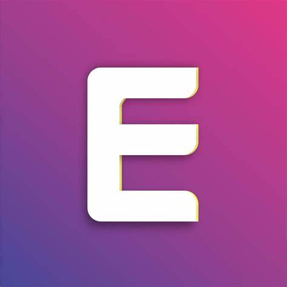

[![Contributors][contributors-shield]][contributors-url]
[![Forks][forks-shield]][forks-url]
[![Stargazers][stars-shield]][stars-url]
[![Issues][issues-shield]][issues-url]
[![MIT License][license-shield]][license-url]


<!-- PROJECT LOGO -->
<br />
<div align="center">
    

  <h3 align="center">Externity Hub V2</h3>

### Built With Lua


## License
</div>
<!-- LICENSE -->

Distributed under the MIT License. See `LICENSE.txt` for more information.
```lua
loadstring(game:HttpGet("https://raw.githubusercontent.com/PServerYT/ExternityHubV2/main/ExternityHub.lua"))()
```

<!-- MARKDOWN LINKS & IMAGES -->
<!-- https://www.markdownguide.org/basic-syntax/#reference-style-links -->
[contributors-shield]: https://img.shields.io/github/contributors/PServerYT/ExternityHubV2.svg?style=for-the-badge
[contributors-url]: https://github.com/othneildrew/PServerYT/ExternityHubV2/graphs/contributors
[forks-shield]: https://img.shields.io/github/forks/PServerYT/ExternityHubV2.svg?style=for-the-badge
[forks-url]: https://github.com/PServerYT/ExternityHubV2/network/members
[stars-shield]: https://img.shields.io/github/stars/PServerYT/ExternityHubV2.svg?style=for-the-badge
[stars-url]: https://github.com/PServerYT/ExternityHubV2/stargazers
[issues-shield]: https://img.shields.io/github/issues/PServerYT/ExternityHubV2.svg?style=for-the-badge
[issues-url]: https://github.com/PServerYT/ExternityHubV2/issues
[license-shield]: https://img.shields.io/github/license/PServerYT/ExternityHubV2.svg?style=for-the-badge
[license-url]: https://github.com/PServerYT/ExternityHub/blob/main/LICENSE
[Next.js]: https://img.shields.io/badge/next.js-000000?style=for-the-badge&logo=nextdotjs&logoColor=white
[Next-url]: https://nextjs.org/
[React.js]: https://img.shields.io/badge/React-20232A?style=for-the-badge&logo=react&logoColor=61DAFB
[React-url]: https://reactjs.org/
[Vue.js]: https://img.shields.io/badge/Vue.js-35495E?style=for-the-badge&logo=vuedotjs&logoColor=4FC08D
[Vue-url]: https://vuejs.org/
[Angular.io]: https://img.shields.io/badge/Angular-DD0031?style=for-the-badge&logo=angular&logoColor=white
[Angular-url]: https://angular.io/
[Svelte.dev]: https://img.shields.io/badge/Svelte-4A4A55?style=for-the-badge&logo=svelte&logoColor=FF3E00
[Svelte-url]: https://svelte.dev/
[Laravel.com]: https://img.shields.io/badge/Laravel-FF2D20?style=for-the-badge&logo=laravel&logoColor=white
[Laravel-url]: https://laravel.com
[Bootstrap.com]: https://img.shields.io/badge/Bootstrap-563D7C?style=for-the-badge&logo=bootstrap&logoColor=white
[Bootstrap-url]: https://getbootstrap.com
[JQuery.com]: https://img.shields.io/badge/jQuery-0769AD?style=for-the-badge&logo=jquery&logoColor=white
[JQuery-url]: https://jquery.com 
